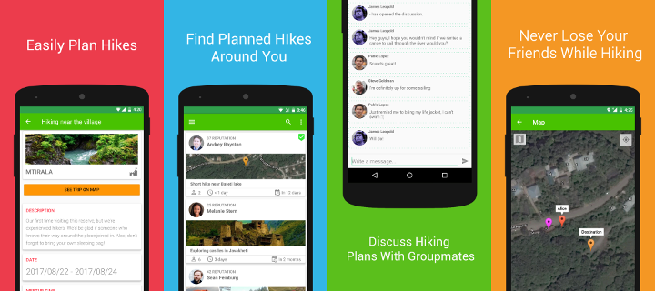

# xplore

This is a repository of Xplore, an Android application that assists hikers with searching/creating/joining/organizing hiking trips with other hikers. It is old and no longer maintained due to Xplore's closure.

If you want to know more about Xplore and how it failed, check out my blog post: [Learning from your failed startup](https://nikaoto.com/blog/learning-from-your-failed-startup).

Old Xplore landing page: [https://xploreapp.github.io](https://xploreapp.github.io)

New Xplore landing page: [https://xplore-landing.netlify.com](https://xplore-landing.netlify.com)

Google Play link: [https://play.google.com/store/apps/details?id=com.xplore](https://play.google.com/store/apps/details?id=com.xplore)

### Notice

The app's online features will not work since I've stopped hosting the back-end.

### Requirements

Minimum Android SDK Version: 19 (v4.4 KitKat)

This repo doesn't include private keys and temporary files, google services won't work without them.

### Libraries Used

Check the `dependencies.gradle` for a full list.

### License

The Xplore Android app is licensed under the [2-clause BSD license](LICENSE).
